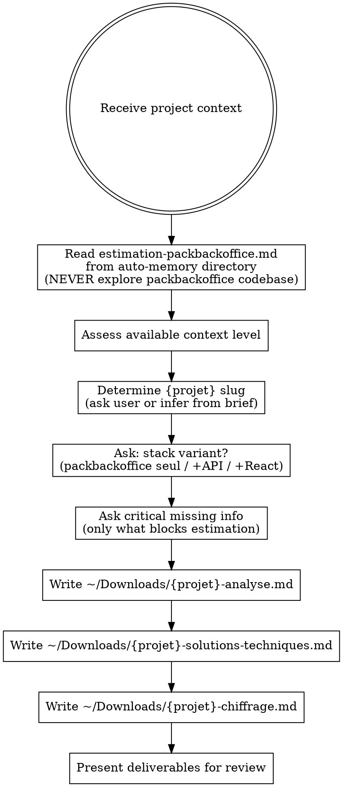

# Project Estimation

## Overview

Structured estimation process for SIQUAL web projects based on packbackoffice (Symfony). Produces 3 markdown deliverables in French, adapted to available input context.

## When to Use

- User types `/estimate`, `/chiffrage`, `/devis`
- User provides project brief, specs, mockups, transcripts, or requirements
- User asks for an estimation, chiffrage, or devis

## Process

## Context Adaptation

The estimation adapts to available input. More context = more precise estimate.

| Context level | What's available | Approach |
|--------------|-----------------|----------|
| **Minimal** | Brief oral/written description | Wide ranges (x2), many open questions, assumptions listed explicitly |
| **Standard** | Brief + some documents (mockup, existing app, data samples) | Moderate ranges (x1.5), cross-reference documents vs brief |
| **Rich** | Brief + mockup + transcript + real documents + data samples | Tight ranges, detailed divergence analysis between sources |

**Key rule**: Never invent requirements. If context is sparse, state assumptions and flag open questions. Wide estimate ranges are honest, not a sign of weakness.

## Deliverables

All files written to `~/Downloads/`. Language: **French**.

`{projet}` is a kebab-case slug derived from the project name (e.g., `gestion-stock`, `colza-normandie`). Ask the user if ambiguous.

### 1. `{projet}-analyse.md` — Cross-source Analysis

Structure:
- Sources analysed (list all inputs)
- What's coherent across sources (the solid base)
- Divergences and arbitration points (table: Subject | Source A | Source B | Analysis)
- What sources overestimate for V1
- What sources underestimate
- Detailed analysis of real documents (if available)
- Mockup analysis (if available): screens, data model, what's missing vs real documents
- V1/V2 split recommendation with priorities
- Key info from transcript (if available): confirmations, new info, impact on priorities
- Vigilance points for estimation

When sources conflict, priority order: **transcript > real documents > mockup > brief** (closer to the actual user intent wins).

### 2. `{projet}-solutions-techniques.md` — Technical Solutions

Structure:
- Recommended stack (with justification based on packbackoffice capabilities)
- Architecture (entities, controllers, bundles needed)
- What packbackoffice provides for free (reference memory file)
- What must be built custom
- Technical risks and mitigations
- Stack additions needed (API Platform, React, Workflow, etc.) with setup cost from memory file

### 3. `{projet}-chiffrage.md` — Detailed Estimate

Structure:
- Summary table: | Scenario | Jours | Heures | Cout HT |
- Phase breakdown table (see benchmarks below)
- Detailed postes table: | Poste | Jours min | Jours max | Commentaire |
- Financial projection (TJM: 697.69EUR/j, 7h/day, 99.67EUR/h)
- Open questions table: | # | Question | Impact estimation | Statut |
  - Answered questions show: `Repondu: {answer} ({source}) — {impact}`
- Exclusions (what's NOT included)
- Hypotheses and limits
- Recommendation section with scenarios (V0.5 budget-fit / V1 full / V1+V2)

**Budget-to-scope**: when a budget is given, compute available days (budget / 697.69) and work backward to find what fits. Present as a scenario.

## Estimation Conventions

- **TJM**: 697.69EUR/j (99.67EUR/h, 7h/day)
- **AI-assisted testing**: when Claude writes tests during dev, Tests & qualite = setup + debug + review only (2-3j typical V1 instead of 4-6j)
- **Packbackoffice savings**: typically 90-130h on a full project (admin, CRUD, auth, uploads, layout)
- **CRUD time** (from memory file): Simple 1-2h, Medium 2-4h, Complex 4-8h (includes entity, repo, form, filter, controller, roles, routes, templates, translations, menu, migration)
- **Tests add ~30-50%** on top of dev time (when not AI-assisted)

### Phase Benchmarks (typical % of total)

| Phase | % typique | Contenu |
|-------|:---------:|---------|
| Cadrage | 5-10% | Specs, data model validation, questions |
| Developpement | 55-65% | Entities, CRUD, custom logic, frontend |
| Controle qualite | 10-15% | Tests, PHPStan, review (reduced if AI-assisted) |
| Recette client | 10-15% | Client testing rounds, bug fixes, adjustments |
| Gestion de projet | 8-12% | Meetings, follow-up, documentation |

## Critical Rules

1. **Read the packbackoffice memory file first** — search for `estimation-packbackoffice.md` in the auto-memory directory. It contains everything about packbackoffice capabilities. NEVER explore the packbackoffice codebase during estimation.
2. **Always produce all 3 files** — even with minimal context (mark sections as "insufficient context" rather than skip).
3. **Cross-reference all sources** — when multiple inputs exist, actively look for divergences. Priority: transcript > real documents > mockup > brief.
4. **Questions are first-class deliverables** — unknown items get an open question with estimated impact, not a silent assumption.
5. **Ranges, not point estimates** — always min-max days. Wider with less context.
6. **Verify totals** — manually recount all postes before writing the total.

## Stack Variant Question

Always ask early (unless obvious from context):

> Quelle variante de stack ?
> 1. **Packbackoffice seul** (Twig + jQuery/JS) — admin classique, formulaires Symfony
> 2. **+ API Platform** — si besoin d'endpoints REST (app mobile, frontend separe)
> 3. **+ React (Webpack Encore)** — si UX tablette avancee, formulaires complexes, offline

This choice significantly impacts the estimate structure.

## Common Mistakes

- **Exploring the packbackoffice codebase** instead of reading the memory file — wastes tokens and time
- **Forgetting multi-scenario presentation** — always present V0.5 (budget-fit) + V1 (full) when budget is tight
- **Point estimates** — "15 jours" instead of "12-18 jours" hides uncertainty
- **Silent assumptions** — every unknown should be an open question with impact, not a baked-in guess
- **Wrong total** — always recount postes manually, accumulated rounding errors are common
- **Missing exclusions** — always list what's NOT included (hosting, content, training, maintenance, etc.)
